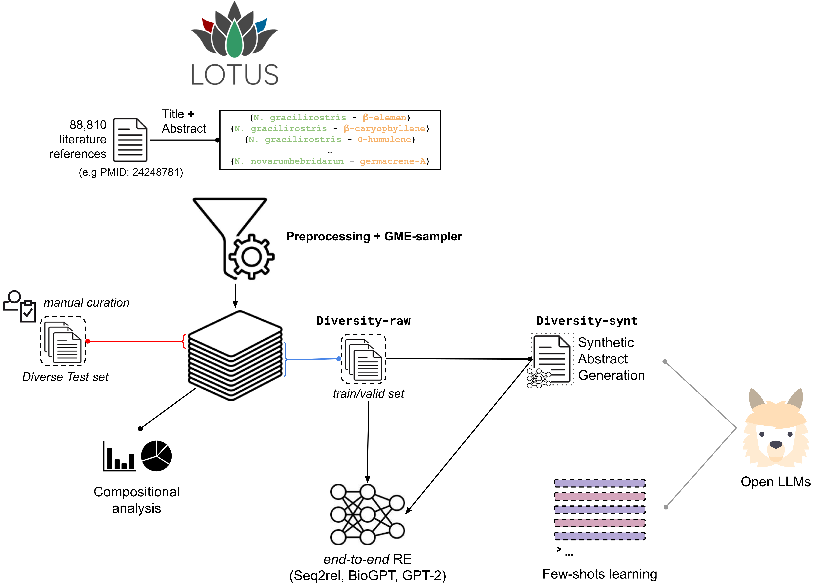

[](https://www.python.org/downloads/release/python-390/) [](https://www.python.org/downloads/release/python-3100/) [](https://www.gnu.org/licenses/gpl-3.0) [](https://arxiv.org/abs/2311.06364)

# Relation Extraction in underexplored biomedical domains: A diversity-optimised sampling and synthetic data generation approach

**Code for the article "Relation Extraction in underexplored biomedical domains: A diversity-optimised sampling and synthetic data generation approach"**

## Abstract:
The sparsity of labelled data is an obstacle to the development of Relation Extraction models and the completion of databases in various biomedical areas. While being of high interest in drug-discovery, the natural-products literature, reporting the identifications of potential bioactive compounds from organisms, is a concrete example of such an overlooked topic. To mark the start of this new task, we created the first curated evaluation dataset and extracted literature items from the LOTUS database to build training sets. To this end, we developed a new sampler inspired by diversity metrics in ecology, named Greedy Maximum Entropy sampler, or [GME-sampler](https://github.com/idiap/gme-sampler). The strategic optimization of both balance and diversity of the selected items in the evaluation set is important given the resource-intensive nature of manual curation. After quantifying the noise in the training set, in the form of discrepancies between the input abstracts text and the expected output labels, we explored different strategies accordingly. Framing the task as an end-to-end Relation Extraction, we evaluated the performances of standard fine-tuning with models such as BioGPT, GPT-2 and Seq2Rel, as a generative task, and few-shots learning with open Large Language Models (LLaMa 7B-65B). Interestingly, the training sets built with the GME-sampler also exhibit a tendency to tip the precision-recall trade-off of trained models in favour of recall. In addition to their evaluation in few-shots settings, we explore the potential of models (Vicuna-13B) as synthetic data generator and propose a new workflow for this purpose. All evaluated models exhibited substantial improvements when fine-tuned on synthetic abstracts rather than the original noisy data. We provide our best performing ($\text{f1-score}=59.0$) BioGPT-Large model for end-to-end RE of natural-products relationships along with all the generated synthetic data and the evaluation dataset. See more details [here](https://github.com/idiap/abroad-re).


**&rarr; Test our BioGPT-Large model fine-tuned on Diversity-synt** [](https://colab.research.google.com/github/idiap/abroad-re/blob/main/notebooks/inference.ipynb))



* * *

## Released Datasets

|Dataset|Description|Zenodo|
|----|----|---|
|Synthetic datasets Vicuna-13B-1.3 | Synthetic datasets (training/validation) for end-to-end Relation Extraction of relationships between Organisms and Natural-Products: *Diversity-synt*, *Random-synt*, *Extended-synt* | [](https://doi.org/10.5281/zenodo.8422294)
|Evaluation dataset|A curated evaluation dataset for end-to-end Relation Extraction of relationships between organisms and natural-products.|[](https://doi.org/10.5281/zenodo.8422007)|


## Released models

|Model|Description|🤗 Hub|
|----|----|---|
|biogpt-Natural-Products-RE-Diversity-synt-v1.0| The model is a derived from microsoft/biogpt and was trained on *Diversity-synt*.|[link](https://huggingface.co/mdelmas/biogpt-Natural-Products-RE-Diversity-synt-v1.0)|
biogpt-Natural-Products-RE-Extended-synt-v1.0 | The model is a derived from microsoft/biogpt and was trained on *Extended-synt*.|[link](https://huggingface.co/mdelmas/biogpt-Natural-Products-RE-Extended-synt-v1.0)|
BioGPT-Large-Natural-Products-RE-Diversity-synt-v1.0 | The model is a derived from microsoft/BioGPT-Large and was trained on *Diversity-synt*.|[link](https://huggingface.co/mdelmas/BioGPT-Large-Natural-Products-RE-Diversity-synt-v1.0)|
BioGPT-Large-Natural-Products-RE-Extended-synt-v1.0 | The model is a derived from microsoft/BioGPT-Large and was trained on *Extended-synt*.|[link](https://huggingface.co/mdelmas/BioGPT-Large-Natural-Products-RE-Extended-synt-v1.0)|

## Table of contents
- [Table of contents](#table-of-contents)
- [Dataset pre-processing, extraction and formating](#dataset-pre-processing,-extraction-and-formating)
    - [Building environment (dataset)](#building-environment-dataset)
    - [Preprocessing LOTUS dataset](#preprocessing-of-the-lotus-dataset)
    - [Sampling with the GME-sampler](#sampling-with-the-gme-sampler)
    - [Formating](#formating)
    - [Extract synonyms (optional)](#extract-synonyms-optional)
    - [Split the dataset](#split-the-dataset)
- [Synthetic data generation](#synthetic-data-generation)
    - [Building environment (llm)](#building-environment-llm)
    - [Models quantization](#models-quantization)
    - [Instructions generation](#instructions-generation)
    - [Synthetic Abstract generation](#synthetic-abstract-generation)
- [Fine-tuning](#fine-tuning)
    - [Building environment (qlora)](#building-environment-qlora)
    - [Hyperparameters tuning (BioGPT)](#hyperparameters-tuning-biogpt)
    - [Fine-tuning BioGPT (QLoRA)](#fine-tuning-biogpt-qlora)
    - [Fine-tuning GPT-2 (QLoRA)](#fine-tuning-gpt-2-qlora)
    - [Inference with a BioGPT/BioGPT-Large model](#inference-with-a-biogptbiogpt-large-model)
- [Seq2rel](#seq2rel)
    - [Building environment (seq2rel)](#building-environment-seq2rel))
    - [Convert datasets to seq2rel format](#convert-datasets-to-seq2rel-format)
    - [Hyperparameters tuning](#hyperparameters-tuning)
    - [Seq2rel Finetuning](#seq2rel-finetuning)
    - [Inference with Seq2rel](#inference-with-seq2rel)
- [Few-shot learning](#few-shot-learning)

## Dataset pre-processing, extraction and formating

### Building environment (dataset)

```bash
conda env create -f env/dataset-creator.yml
```

### Preprocessing of the LOTUS dataset

The original snapshot of the LOTUS database (v.10 - Jan 6, 2023) used in this work is available at 
[](https://doi.org/10.5281/zenodo.7534071).

The LOTUS dataset used is licensed under CC BY 4.0. See the related [article](https://elifesciences.org/articles/70780) and the [website](https://lotus.naturalproducts.net/) for more details.

Secondly, we extracted available links between DOI and PubMed PMID identifiers using a SPARQL request on [wikidata](https://query.wikidata.org/). The corresponding result file is provided at ```data/raw/wikidata-doi2pmid.tsv```.

To preprocess the data, use:

```bash
python app/dataset-creation/preprocessing.py \
    --lotus-data="/path/to/230106_frozen_metadata.csv" \
    --doi2pmid="data/raw/wikidata-doi2pmid.tsv" \
    --out-dir="/path/to/output-dir" \
    --max-rel-per-ref=20 \
    --chemical-name-max-len=60
```

In this step, we applied the following filters:

* *Duplicates filtering*

* Only references for which a PMID was retrieved (from ```wikidata-doi2pmid.tsv```) were conserved.

* All references that report more than *k* relations were excluded. (We chose $k=20$.)

* All associations involving a chemical with a name longer than $60$ characters (likely to be IUPAC-like) were excluded.


### Sampling with the GME-sampler

Then, the GME-sampler can be applied on the pre-processed dataset to extract $500$ literature references per by biological kingdoms.

In the output directory, a sub-directory name ```entropies``` is created and is used to store entropy metrics.

This script can also be use alternatively with other sampling strategies (*--sampler* arg): "random", "topn_rel", "topn_struct", "topn_org", "topn_sum".

```bash
python app/dataset-creation/create_lotus_dataset.py \
    --lotus-data="/path/to/processed_lotus_data.tsv" \
    --out-dir="path/to/output/dir" \
    -N=-1 \
    --use-freq \
    --n-workers=6 \
    --sampler="GME_dutopia"
```

### Formating

To fetch the abstracts from PubMed and format the data, use:

```bash
python app/dataset-creation/get_abstract_and_format.py \
    --input="path/to/dataset.tsv" \
    --ncbi-apikey="xxx" \
    --chunk-size=100 \
    --out-dir="path/to/output/dir"
```

To fasten the fetching processing, you may need to provide an [NCBI ApiKey](https://support.nlm.nih.gov/knowledgebase/article/KA-05317/en-us).


### Extract synonyms (optional)

This step is optional, but will provide usefull data for building the exclusion list used in the section [Instructions generation](#instructions-generation).

Synonym extraction can be done manually in 3 simple steps:

- 1) Extract the full list of distinct PubChem CID identifiers.
- 2) Go the the [PubChem Identifier Exchange Service](https://pubchem.ncbi.nlm.nih.gov/idexchange/idexchange.cgi)
        * Select **CIDs** in *Input ID List*
        * **Same, Isotopes** in *Operator Type*. **Same, Isotopes** correspond to  “same isotopes and connectivity but different stereochemistry.” Since the harmonization step could have failed to map the correct stereoisomers because of incomplete information, it is better to try to extract all the synonyms of the corresponding CID.
        * **Synonyms** in *Output IDs*
- 3) Save the result in a tabular file (e.g CID2synonyms.txt) which will be used to create the exclusion list.


### Split the dataset:

There are two ways of spliting the built dataset between **entropy** and **std** (i.e standard)

- When providing **entropy**: the top-n (*--top-n*) DOI associated with the maximum entropy (*diversity*) will be selected to be integrated in the test set. In this case, both the *--entropy-dir* and *--top-n* must be provided. The proportion in which the remaining set is to be split between the training set and the validation set should be indicated with *--split-prop*. For instance, use "90:10:0" to indicate that 90% of the remaining set will be keep for training and 10% for validation.

- When providing **std**: a classic random split is applied according to the proportion expressed in *--split-prop* (e.g. 80:10:10 by default).

```bash
python app/dataset-creation/split_dataset.py \
    --dataset="path/to/dataset.json" \
    --out-dir="path/to/output/dir" \
    --split-mode="entropy" \
    --entropy-dir="Path/to/entropies" \
    --top-n=50 \
    --split-prop="90:10:0"
```

## Synthetic data generation

For generating synthetic abstracts at scale, we strongly recommened spliting the datasets in several batches. Several utilities are available for this purpose, see *split_json* and *merge_json* in ```app/synthetic-data-generation/general_helpers.py```

### Building environment (llm)

- Step 1: Create the base environment with all the external dependencies.

```bash
conda env create -f env/llm.yml
```
**Tips:** use [mamba](https://anaconda.org/conda-forge/mamba) instead of conda to build faster !

- Step 2: On this base env, install and compile [llama.cpp](https://github.com/ggerganov/llama.cpp) and **install** [llama-cpp-python](https://github.com/abetlen/llama-cpp-python).
In both cases, we (strongly) recommend using the **CuBLAS** build for gpu acceleration. However, depending on you environment you may need to tweek the install settings (particularly cuda).
For CuBLAS install of **llama-cpp-python**, use: 

```bash
CMAKE_ARGS="-DLLAMA_CUBLAS=on" pip install llama-cpp-python --force-reinstall --upgrade --no-cache-dir
```

Experiments presented in the article were carried using the version ```0.1.78``` of ```llama-cpp-python```. However in the meantime, an update of ```llama.cpp``` changed the file format of the models from ```ggml``` to ```gguf```. Experiments were succesfully reproduced with the more recent version ```0.2.11```.

- **Warning:** Check that the ```llama.cpp``` build is compatible with ```llama-cpp-python```, as ```llama.cpp``` will be use to convert and quantize model in ggml format.

### Models quantization

For details about models' quantization, please refer to the documentation of [llama.cpp](https://github.com/ggerganov/llama.cpp).

For instance, in ```llama.cpp``` dir:
```bash
# convert the model to ggml FP16 format by providing the path to the directory containing the wieghts
python3 convert.py /path/to/model/weights/dir --outfile="models/ggmluf-model-f16.gguf"

./quantize ./models/ggmluf-model-f16.gguf ./models/ggml-model-q8_0.gguf Q8
```

For models with $\le 13B$ we used the ```Q8``` quantization, while we applied ```Q5_K_M``` for bigger models (e.g LLaMA 30B and 65B).

In the paper, we used [Vicuna-13b-v1.3](https://huggingface.co/lmsys/vicuna-13b-v1.3). It was quantized using ```llama.cpp``` at **master-bbca06e** and we used ```llama-cpp-python``` *v. 0.1.78*.

### Instructions generation

To more effectively control the expression of NP relationships during the generation step, it is necessary to explicitly formalize the anticipated patterns in upstream instructions. The LLM is first use to extract a list of keyphrases to give a biomedical context (filtered by an exclusion list) and then sample patterns of expression. 


The following code will generate a hand of instructions to give an example.
```bash
# set up
conda activate llm

# vars
LAUNCHPATH="./app/synthetic-data-generation"
INPUT="data/examples/example-input.json"
SYNPATH="data/examples/example-CID2synonyms.txt"
CLASSPATH="data/extras/mapping_np_classifier.tsv"
MODEL="/path/ggmlorgguf/model/file"

OUTPATH="output/examples/instructions"
CACHEPATH="output/examples/instructions/instructions-cache"
mkdir -p $OUTPATH
mkdir -p $CACHEPATH


python $LAUNCHPATH/run_abstract_instruction.py --input-file=$INPUT \
    --chemical-classes=$CLASSPATH \
    --method="llama.cpp" \
    --out-dir=$OUTPATH \
    --use-pubtator \
    --model-path-or-name=$MODEL \
    --cache-dir=$CACHEPATH \
    --path-to-synonyms=$SYNPATH \
    --top-n-keywords=10 \
    --m-prompts-per-item=10
```

In the provided settings, the top **10** keywords/keyphrases (*--top-n-keywords*) of each original seed abstract is first extracted by prompting the LLM with different temperatures, by default: $\{0.4, 0.5, 0.6, 0.7\}$. Keywords can also be extracted using KeyBERT by specifying *--method="KeyBERT"* and the used BERT model with *--model-path-or-name*. The lists of keyphrases are filtered using an exclusion list built from the list of compounds names and [synonyms](#extract-synonyms-optional) (*--path-to-synonyms*) and potentially annoated entities extracted with [PubTator](https://www.ncbi.nlm.nih.gov/research/pubtator/). Then, **10** prompts with different NP relationships expression patterns are sampled (*--m-prompts-per-item*). 

You can also use the arguments *--m-threads* and *--m-n-gpu* to set the number of threads and layers on GPUs. For Vicuna-13B by default all ($43 layers$) are put on GPUs with only 1 thread.

More details with:
```bash
python $LAUNCHPATH/run_abstract_instruction.py --help
```

### Synthetic Abstract Generation

In this step, each of the previously generated prompts are fed into the LLM to generate synthetic abstracts. The created instructions have the following form:

```text
Instructions: Given a title, a list of keywords and main findings, create an abstract for a scientific article.
Title: Metabolites with nematicidal and antimicrobial activities from the ascomycete Lachnum papyraceum (Karst.) Karst. III. Production of novel isocoumarin derivatives, isolation, and biological activities.
Keywords: nematicidal activities, cytotoxic activities, secondary metabolism, cabr2, phytotoxic activities, antimicrobial activities, bromide-containing culture media, phytotoxic, cytotoxic, weak antimicrobial.
Main findings: Five Coumarins, two Miscellaneous polyketides and two Sesquiterpenoids were isolated from Lachnum papyraceum.
```  

Using the selector module, only the top-3 best generations are extracted by the selector module.

With the previously generated instruction examples, the following code will generate synthetic abstracts:
```bash
LAUNCHPATH="./app/synthetic-data-generation"
INPUT="output/examples/instructions/prompts_example-input.json"
MODEL="/path/ggmlorgguf/model/file"

OUTPATH="output/examples/generations"
mkdir -p $OUTPATH

python $LAUNCHPATH/run_abstract_generation.py \
    --model=$MODEL \
    --input-file=$INPUT \
    --out-dir=$OUTPATH \
    -N=3
```

* Again, you can also use the arguments *--m-threads* and *--m-n-gpu* to set the number of threads and layers on GPUs.

## Fine-tuning

### BioGPT and GPT-2

The following section covers the code for the hyperparameter tuning and fine-tuning of BioGPT and the GPT-2 baseline. 

#### Building environment (qlora)

```bash
conda env create -f env/qlora.yml
```
**Warning:** if install of bitsandbytes failed, you may need to install it from source. See for instance [here](https://github.com/TimDettmers/bitsandbytes/blob/main/errors_and_solutions.md) or [here](https://github.com/TimDettmers/bitsandbytes/blob/main/how_to_use_nonpytorch_cuda.md) and check the variables: BNB_CUDA_VERSION, CUDA, LD_LIBRARY_PATH.

#### Hyperparameters tuning (BioGPT)

In the article, we performed the tuning with 80 trials, using the median pruner, on the **Diversity-synt dataset** (see the corresponding dataset on Zenodo [here](https://zenodo.org/records/8422294)).

In the following example, we only use the previously generated abstracts and a subset of our validation dataset. Also, only $3$ trials (*N_TRIAL*) are performed.

Optuna supports [parallelization](https://optuna.readthedocs.io/en/stable/tutorial/10_key_features/004_distributed.html) during hyperparameters tuning. The *--tag* argument is used to distinguish different runs. You can also vizualise the tuning through the [optuna-dashboard](https://github.com/optuna/optuna-dashboard).

In these examples, the training set is too small and training will only led to null $\text{f1-score}$. Consider using the training/validation datasets provided on Zenodo.


```bash
conda activate qlora

LAUNCHPATH="./app/biogpt-lora"
VALID_PATH="data/examples-validation/sub_valid.json"
TRAIN_PATH="output/examples/generations/out_prompts_example-input.json"
MODEL_HF="microsoft/biogpt"
N_TRIAL=3

OUTPUT_DIR="output/examples/fine-tuning/hp-tuning/biogpt"
mkdir -p $OUTPUT_DIR

python $LAUNCHPATH/hyperparameters.py --model-name=$MODEL_HF \
    --train=$TRAIN_PATH \
    --valid=$VALID_PATH \
    --out-dir=$OUTPUT_DIR \
    --tag="1" \
    --n-trials=$N_TRIAL
```

The hyperparameters estimated for BioGPT were reused for GPT-2.

#### Fine-tuning BioGPT (QLoRA)

In the article BioGPT was fine-tuned according to the tuned hyperparameters, i.e: $lr=1e-4$, $\text{batch-size}=16$, $r=8$, $\alpha=16$, $\text{n-epochs}=15$.

In this example, we used the previously generated abstracts but the training set is too small and training will only led to null $\text{f1-score}$, then no model are saved at the end of the training. Consider using the training sets provided on Zenodo.

```bash
conda activate qlora

LAUNCHPATH="./app/biogpt-lora"
VALID_PATH="data/examples-validation/sub_valid.json"
TRAIN_PATH="output/examples/generations/out_prompts_example-input.json"
MODEL_HF="microsoft/biogpt"

OUTPUT_DIR="output/examples/fine-tuning/biogpt"
mkdir -p $OUTPUT_DIR

python $LAUNCHPATH/finetune.py --model-name=$MODEL_HF \
    --train=$TRAIN_PATH \
    --valid=$VALID_PATH \
    --batch_size=16 \
    --r_lora=8 \
    --alpha_lora=16 \
    --lr=1e-4 \
    --out-dir=$OUTPUT_DIR
```

See for the other arguments:

```bash
python $LAUNCHPATH/finetune.py --help
```

**For training a BioGPT-Large, simply change the --model-name argument by 'microsoft/BioGPT-Large'.**

#### Fine-tuning GPT-2 (QLoRA)

Same for GPT-2 baseline.

```bash
LAUNCHPATH="./app/biogpt-lora"
VALID_PATH="data/examples-validation/sub_valid.json"
TRAIN_PATH="output/examples/generations/out_prompts_example-input.json"
MODEL_HF="gpt2-medium"

OUTPUT_DIR="output/examples/fine-tuning/gpt2"
mkdir -p $OUTPUT_DIR

python $LAUNCHPATH/finetune-gpt2.py --model-name=$MODEL_HF \
    --train=$TRAIN_PATH \
    --valid=$VALID_PATH \
    --batch_size=16 \
    --r_lora=8 \
    --alpha_lora=16 \
    --lr=1e-4 \
    --out-dir=$OUTPUT_DIR 
```

See for the other arguments:

```bash
python $LAUNCHPATH/finetune-gpt2.py --help
```

#### Inference with a BioGPT/BioGPT-Large model

Here is an example with a BioGPT-Large model with the adapters fine-tuned with the created **Diversity-synt** dataset. We use the same evaluation dataset as in the article. The parameters for decoding were also tuned.

You can use either the adapters uploaded on hugginface or simply the path to the directory containing the trained adapeters, by removing the *--hf* argument.

Similarly, use *inference_eval_gpt2.py* for inference using GPT-2 models. As their only serve as baselines, we did not pushed them to the HF hub.

```bash
conda activate qlora

LAUNCHPATH="./app/biogpt-lora"
MODEL="microsoft/BioGPT-Large"
ADAPTERS="mdelmas/BioGPT-Large-Natural-Products-RE-Diversity-synt-v1.0"
OUTPUTDIR="output/examples/evals/biogpt/4"
TEST="data/test-set/curated_test_set.json"
mkdir -p $OUTPUTDIR

python $LAUNCHPATH/inference_eval.py \
    --source-model=$MODEL \
    --lora-adapters=$ADAPTERS \
    --hf \
    --test=$TEST \
    --output-dir=$OUTPUTDIR \
    --valid-b-size=2
```

### Seq2rel

For more details, see the corresponding [repository](https://github.com/JohnGiorgi/seq2rel/tree/main). We are very grateful to the authors for sharing their code.

#### Building environment (seq2rel)

```bash
conda env create -f env/seq2rel.yml
```

#### Convert datasets to seq2rel format.

Seq2rel use a particular format and this converter can be used to convert the generated (or raw) data from our json format to seq2rel's format.

```bash
cond actvate seq2rel

LAUNCHPATH="./app/seq2rel"
OUTPUTDIR="output/examples/generations/seq2rel"

python $LAUNCHPATH/convert_dataset_to_seq2rel.py \
    --input-dir="output/examples/generations" \
    --output-dir=$OUTPUTDIR
```

#### Hyperparameters tuning

Similarly to what was done for BioGPT, we again used Optuna like in the original article of Seq2rel.

```bash
conda activate seq2rel

TAG="1"
LAUNCHPATH="app/seq2rel"
OUTPUT_DIR="output/examples/fine-tuning/hp-tuning/seq2rel"
OUTPUT_SERIALZE="output/examples/fine-tuning/hp-tuning/seq2rel/$TAG"
CONFIG="data/examples/seq2rel-configs/hp-tuning.jsonnet"
N_TRIAL=3

mkdir -p $OUTPUT_SERIALZE

python $LAUNCHPATH/seq2rel_hp_finetuning.py --out-dir=$OUTPUT_DIR \
    --output-serialize=$OUTPUT_SERIALZE \
    --config=$CONFIG \
    --n-trials=$N_TRIAL

rm -rf $OUTPUT_SERIALZE
```

#### Seq2rel Finetuning

For more details and examples, see the corresponding [repository](https://github.com/JohnGiorgi/seq2rel/tree/main).

```bash
conda activate seq2rel

LAUNCHPATH="app/seq2rel"
OUTPUT_DIR="output/examples/fine-tuning/seq2rel"
CONFIG="data/examples/seq2rel-configs/seq2rel-finetuning.jsonnet"

allennlp train $CONFIG \
    --serialization-dir $OUTPUT_DIR \
    --include-package "seq2rel"
```

#### Inference with Seq2rel

Here, we evaluate the performances of a Seq2rel model on the provided curated evaluation dataset.

```bash
export TMPDIR="/path/to/tmp/dir"
MODEL="output/examples/fine-tuning/seq2rel/model.tar.gz"
TEST_PATH="data/test-set/seq2rel/curated_test_set.tsv"
OUTPUT_DIR="output/examples/evals/seq2rel"

mkdir -p $OUTPUT_DIR

allennlp evaluate "$MODEL" "$TEST_PATH" \
    --output-file "$OUTPUT_DIR/test_metrics.jsonl" \
    --predictions-output-file "$OUTPUT_DIR/test_predictions.jsonl" \
    --include-package "seq2rel"
```

## Few-shot learning

Use the same envirionment as for [above](#building-environment-llm).

The following script uses archetypal sentences extracted from abstracts as demonstrative examples in the few-shots learning settings. For instance:

```text
INPUT: The antimicrobially active EtOH extracts of Maytenus heterophylla yielded a new dihydroagarofuran alkaloid, 1beta-acetoxy-9alpha-benzoyloxy-2beta,6alpha-dinicotinoyloxy-beta-dihydroagarofuran, together with the known compounds beta-amyrin, maytenfolic acid, 3alpha-hydroxy-2-oxofriedelane-20alpha-carboxylic acid, lup-20(29)-ene-1beta,3beta-diol, (-)-4'-methylepigallocatechin, and (-)-epicatechin.
OUTPUT: Maytenus heterophylla produces 1beta-acetoxy-9alpha-benzoyloxy-2beta,6alpha-dinicotinoyloxy-beta-dihydroagarofuran. Maytenus heterophylla produces beta-amyrin. Maytenus heterophylla produces maytenfolic acid. Maytenus heterophylla produces 3alpha-hydroxy-2-oxofriedelane-20alpha-carboxylic acid. Maytenus heterophylla produces lup-20(29)-ene-1beta,3beta-diol. Maytenus heterophylla produces (-)-4'-methylepigallocatechin. Maytenus heterophylla produces (-)-epicatechin.
```

From the 5 examples provided, the model is expected to perform the same task implicitely on the last input. Input prompts are adapters to either simply generative (*classic*) or instructions-tuned models (*instruct*) via the *--prompt-type* argument.

```bash
conda activate llm

LAUNCHPATH="app/few-shots"
MODEL="/path/to/ggmlorgguf/model"
TEST="data/test-set/curated_test_set.json"
OUTPUT_DIR="output/examples/evals/icl"

mkdir -p $OUTPUT_DIR

python $LAUNCHPATH/call_icl.py --model=$MODEL \
    --input-file=$TEST \
    --out-dir=$OUTPUT_DIR \
    --prompt-type="instruct"
```

See *--help* on *call_icl.py* to see additional arguments.

From the outputed predictions (*output_curated_test_set.json*), the performances of each model can be evaluated using the following:

```bash
LAUNCHPATH="app/few-shots"
PREDS="output/examples/evals/icl/output_curated_test_set.json"
REF="data/test-set/curated_test_set.json"
OUTPUTDIR="output/examples/evals/icl"

python $LAUNCHPATH/compute_metrics.py --input=$PREDS \
    --output-file="$OUTPUTDIR/perf.json" \
    --test-file=$REF
```


